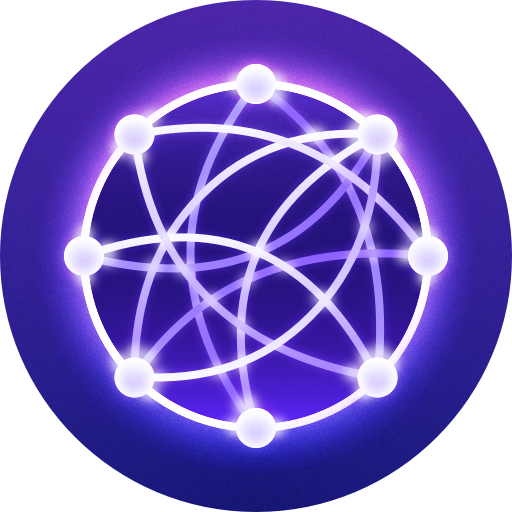

# UniControl

UniControl - это универсальная и мощная система управления и контроля устройств, разработанная для упрощения управления различными устройствами в единой и интуитивной среде. В этом файле README.md предоставляется обзор проекта, его целей и план развития.

## Цели

Основные цели проекта UniControl следующие:

1. **Управление Устройствами Всех Типов**: Создание единой платформы, способной управлять широким спектром устройств, от IoT-сенсоров до умных приборов и промышленного оборудования.

2. **Интуитивный Интерфейс**: Разработка простого и интуитивного интерфейса, который позволит пользователям легко управлять и мониторить свои устройства.

3. **Удаленный Доступ и Мониторинг**: Обеспечение удаленного доступа и мониторинга устройств в режиме реального времени для повышения эффективности и удобства.

4. **Автоматизация и Интеграция**: Внедрение функций автоматизации и возможностей интеграции для оптимизации управления устройствами и обмена информацией.

5. **Безопасность и Защита Данных**: Приоритетом является обеспечение безопасности и конфиденциальности данных пользователей, а также обеспечение безопасности устройств.

## План

### Этап 1: Начало проекта (Текущий этап)

- [x] Определение концепции и целей проекта.
- [x] Создание репозитория GitHub и README.md.
- [x] Настройка основной структуры проекта.

### Этап 2: Проектирование Системы

- [ ] Проектирование ключевых компонентов системы.
- [ ] Разработка пользовательского интерфейса.
- [ ] Планирование хранения и управления данными.

### Этап 3: Разработка

- [ ] Создание основных функций для управления устройствами.
- [ ] Реализация обнаружения устройств и интеграции.
- [ ] Разработка аутентификации и авторизации пользователей.

### Этап 4: Тестирование и Обеспечение Качества

- [ ] Проведение тщательного тестирования и отладки.
- [ ] Учет обратной связи пользователей и улучшение опыта использования.
- [ ] Проведение анализа безопасности и улучшений.

### Этап 5: Развертывание и Масштабирование

- [ ] Подготовка к начальному выпуску.
- [ ] Развертывание системы для общего использования.
- [ ] Планирование масштабирования и будущих улучшений.

### Этап 6: Постоянное Улучшение

- [ ] Мониторинг производительности системы и сбор данных о ее использовании.
- [ ] Выпуск обновлений и новых функций на основе обратной связи пользователей.
- [ ] Исследование возможных партнерств и интеграций с другими платформами.

## Начало работы

Для начала работы с UniControl, вы можете [посетить наш веб-сайт](https://www.unicontrol.com) или следовать инструкциям по установке в [документации](https://docs.unicontrol.com).

## Участие в проекте

Мы приветствуем вклад от сообщества open source. Если вы заинтересованы в участии в проекте UniControl, пожалуйста, прочтите наши [правила участия](CONTRIBUTING.md).

## Лицензия

Этот проект лицензирован в соответствии с лицензией MIT - подробности см. в файле [LICENSE](LICENSE).

---

Спасибо, что рассмотрели UniControl для управления вашими устройствами. Мы рады создать универсальное и удобное решение для вас!
